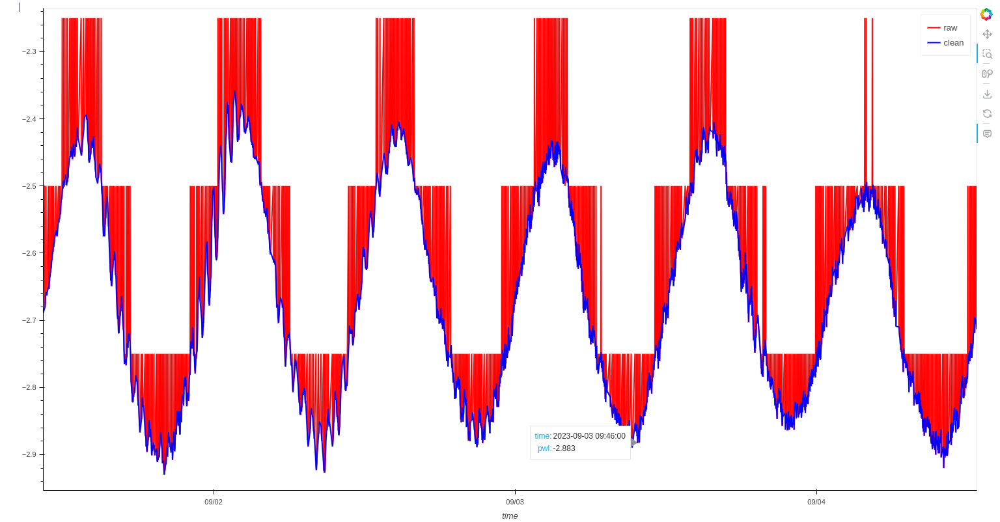

# IOC Cleanup

`ioc_cleanup` provides a 
 * reproducible
 * transparent,
 * and traceable

workflow for cleaning tide gauge (sea level) data from IOC (Intergovernmental Oceanographic Commission) stations worldwide.

## Raw to clean data

## Use the dashboard

Check the [docs](https://tomsail.github.io/ioc_cleanup/)
