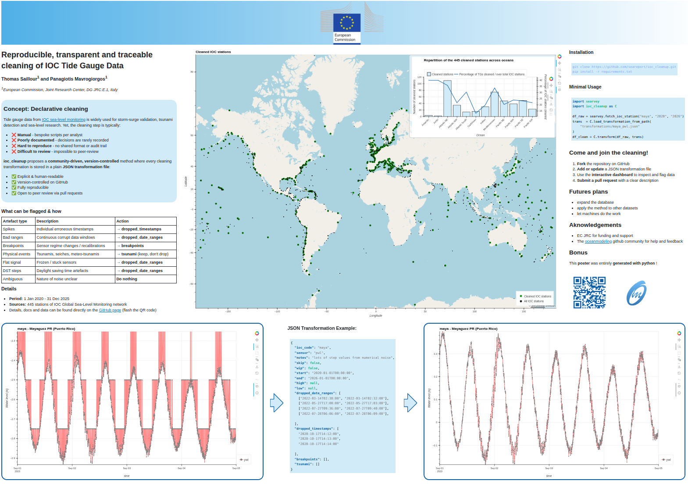

A reproducible poster has been created for the EGU 2026 conference ([doi](https://doi.org/10.5194/egusphere-egu26-7777)).



To reproduce the poster:
```bash
git clone https://github.com/oceanmodeling/ioc_cleanup.git
cd ioc_cleanup
pip install -r requirements/requirements.txt
make poster
```

You can also access it interactivey [here](https://oceanmodeling.github.io/ioc_cleanup/assets/poster.html)
