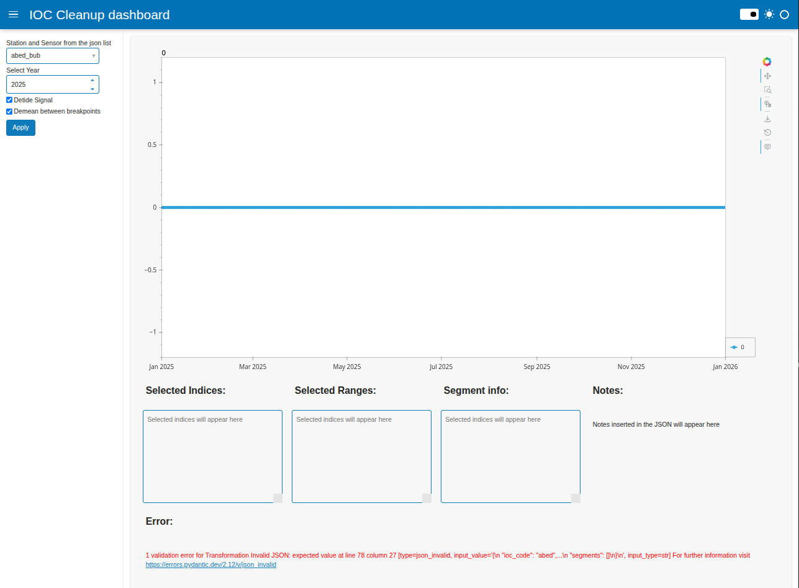
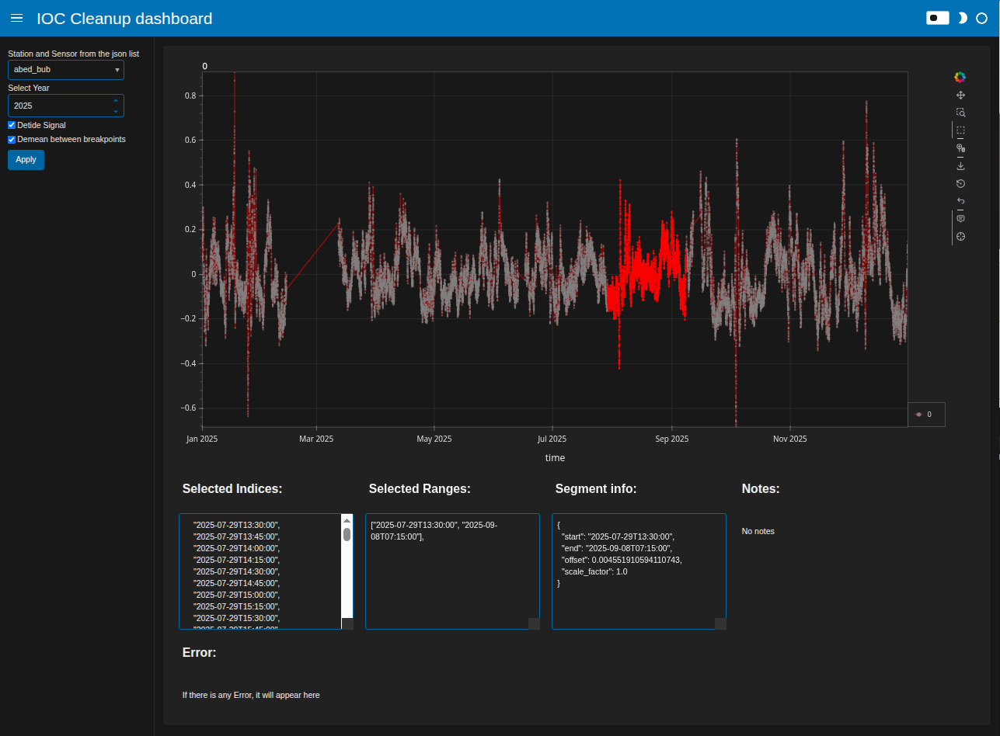

# Interactive Cleaning Dashboard

## Running the dashboard

```bash
python -mpanel serve dashboard/cleanup_dashboard.py
```


## Station dropdown list

Stations are discovered automatically from the JSONs in:
```
./transformations/<ioc_code>_<sensor>.json
```

## Error handling

If a JSON file contains a syntax error or invalid field, the dashboard will show:



## Dark mode

You can activate dark mode by clicking on the top right switch


